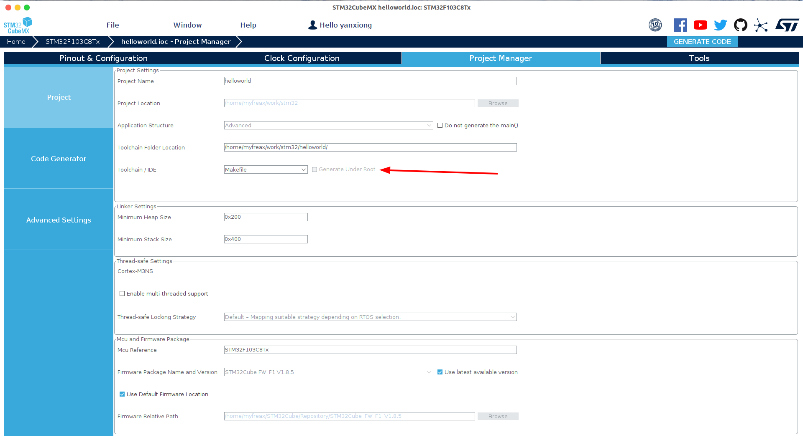
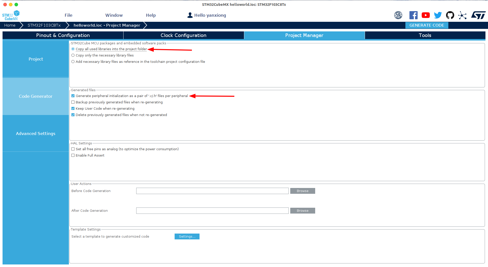
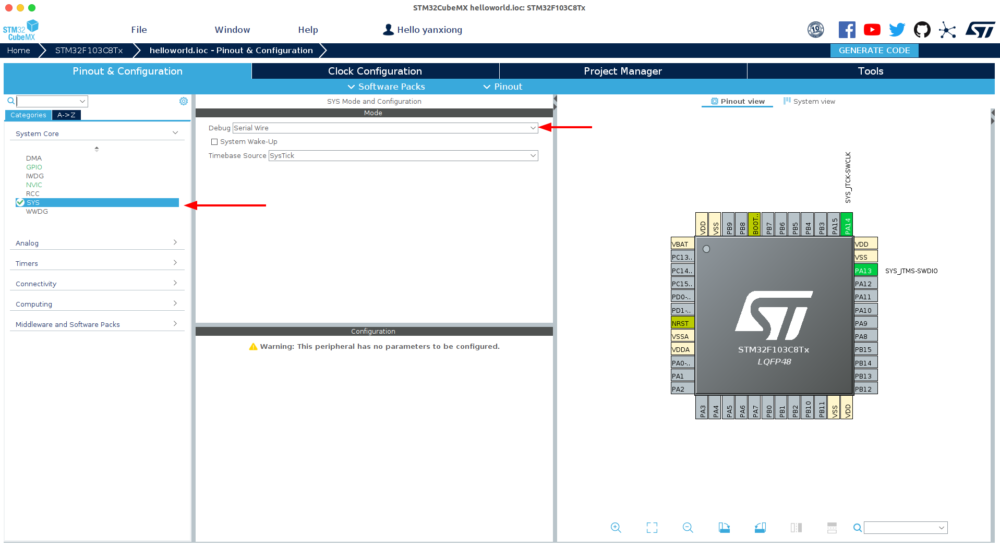

# STM32-HelloWorld

## Installed in your computer
- [ARM ToolChain](https://developer.arm.com/downloads/-/arm-gnu-toolchain-downloads)
- [SMT32cubemx](https://www.st.com/en/development-tools/stm32cubemx.html)
- [JLink](https://www.segger.com/downloads/jlink/)


```shell
sudo apt install openocd
```
## Installed in your Vscode
- [STM32 for VSCode](https://marketplace.visualstudio.com/items?itemName=bmd.stm32-for-vscode)
- [Cortex-Debug](https://marketplace.visualstudio.com/items?itemName=marus25.cortex-debug)

## Create Project
open SMT32cubemx and create a Makefile project under Project Manager->Project->Toolchain/IDE.

Also please leave the default on Copy all used libraries into the project folder.



Configure system core enable J-Link Debug under Pin & Configuration->System Core->sys->mode



Finally click to `Generate Code` in STM32cubemx

## Configure Project
Open project of generated by STM32cubemx with VScode and build once time project run commnad `stm32: build stm32 project` by keydown `ctrl+shift+p`.
Download svd file from [cmsis-svd-data](https://github.com/cmsis-svd/cmsis-svd-data) and place to root directory of project 

Now. change `openocd.cfg` to following content

```
#OpenOCD configuration file, generated by STM32 for VSCode

# Programmer, can be changed to several interfaces
# Standard will be the stlink interface as this is the standard for STM32 dev boards
# source [find interface/stlink.cfg]
source [find interface/jlink.cfg]
transport select swd

# The target MCU. This should match your board
source [find target/stm32f1x.cfg]
```

change `launch.json` to following content
```json
{
  "configurations": [
    {
      "showDevDebugOutput": "parsed",
      "cwd": "${workspaceRoot}",
      "executable": "./build/helloworld.elf",
      "name": "Debug STM32",
      "request": "launch",
      "type": "cortex-debug",
      "servertype": "jlink",
      "preLaunchTask": "Build STM",
      "device": "STM32F103C8",
      "svdFile": "${workspaceRoot}/STM32F103xx.svd",
      "configFiles": [
        "openocd.cfg"
      ]
    },
    {
      "showDevDebugOutput": "parsed",
      "cwd": "${workspaceRoot}",
      "executable": "./build/helloworld.elf",
      "name": "Attach STM32",
      "request": "attach",
      "type": "cortex-debug",
      "servertype": "openocd",
      "preLaunchTask": "Build STM",
      "device": "stm32f103xb.s",
      "configFiles": [
        "openocd.cfg"
      ]
    }
  ]
}
```